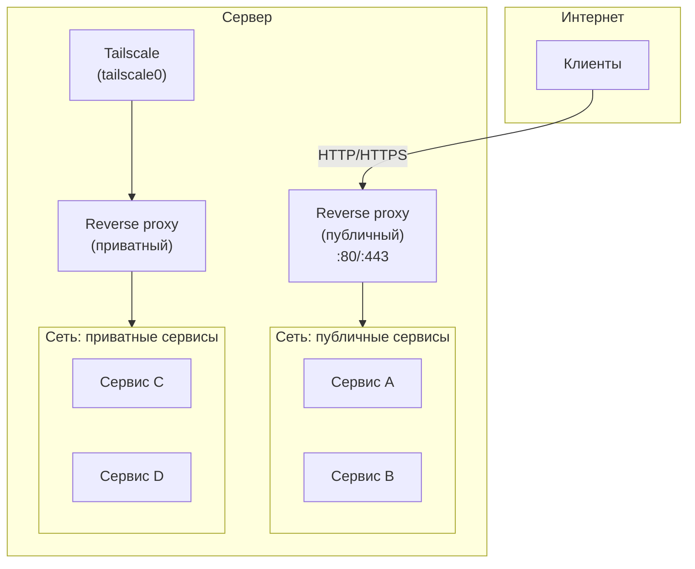
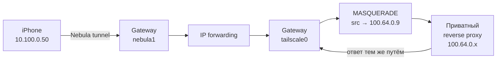

Моя инфраструктура работала на Headscale — self-hosted координационном сервере
для Tailscale. Серверы объединены в mesh-сеть, часть сервисов (мониторинг,
внутренние инструменты) доступна только изнутри VPN. Всё работало, но
Tailscale-клиенты распространяются под BSL (Business Source License), а не MIT.
Хотелось перейти на полностью открытое решение.

Nebula[^1] подошла: MIT-лицензия, открытые клиенты на всех платформах включая
iOS, собственная PKI без зависимости от внешних серверов. Но переключить всё
разом нельзя — к Tailscale привязаны DNS-записи, TLS-сертификаты, ACL приватных
сервисов. Миграция неизбежно растянута во времени.

На переходный период обе сети должны сосуществовать. Устройства, уже
переведённые на Nebula (начал с iPhone), должны сохранить доступ к приватным
сервисам, которые пока остаются в Tailscale. Для этого нужен мост: механизм
`unsafe_routes` в Nebula пробрасывает трафик через gateway-сервер, который
работает в обеих сетях одновременно.

## Что такое Nebula

Nebula — overlay-сеть, которую создали инженеры Slack. Проект решал
конкретную задачу: связать серверы в разных облаках и дата-центрах, избавившись
от сложностей управления IPSec-туннелями между провайдерами[^2]. В 2019 году
код открыли под MIT-лицензией. Сейчас проект развивает
Defined Networking[^3].

Написана на Go, работает на Linux, macOS, Windows, iOS, Android, FreeBSD.

### Сравнение с аналогами

| | Nebula | Tailscale | WireGuard | ZeroTier |
|---|---|---|---|---|
| Топология | Mesh (P2P) | Mesh (координируемый) | Point-to-point | Virtual L2 |
| Координация | Lighthouse (self-hosted) | Tailscale-серверы | Нет | Контроллер |
| Аутентификация | Своя PKI, offline CA | Identity Provider / SSO | Pre-shared keys | Своя PKI |
| Шифрование | AES-256-GCM (Noise IX)[^4] | ChaCha20 (WireGuard) | ChaCha20 | Salsa20 |
| Firewall | Встроенный, на основе групп | ACL через координатор | Нет (host-level) | Через контроллер |
| Память | ~27 МБ | ~200 МБ | Минимальная (ядро) | ~10 МБ |

Важное архитектурное отличие от WireGuard: узлам Nebula не нужно знать публичные
ключи и адреса всех пиров заранее. Новый хост присоединяется к сети без
перенастройки существующих узлов[^5]. В WireGuard каждый новый узел в full mesh
требует обновления конфигурации на всех остальных.

### PKI и сертификаты

Nebula использует собственный Certificate Authority, который вы создаёте и храните
локально[^6]. CA никогда не покидает вашу машину. Каждый узел получает
сертификат, подписанный этим CA, с указанием IP-адреса, групп и срока действия.
При handshake узлы проверяют друг друга по подписи.

Для сравнения: Tailscale управляет сертификатами за вас (или через Headscale),
а WireGuard использует только pre-shared keys — понятия сертификатов у него нет.

Nebula даёт полный контроль ценой ручного управления. Ротацию CA рекомендуется
начинать за 2-3 месяца до истечения: когда CA протухает, хосты перестают
общаться[^7].

### Lighthouse и relay

Lighthouse — точка координации в Nebula-сети. Он помогает узлам найти друг друга
и установить прямое P2P-соединение через hole punching. В отличие от
координационного сервера Tailscale, lighthouse не видит трафик между узлами,
установившими прямое соединение.

Если прямое соединение невозможно (симметричный NAT, строгий файрвол), трафик
идёт через relay. Relay-поддержка появилась в Nebula 1.6.0[^8]. Шифрование
при этом остаётся end-to-end — relay не может расшифровать или модифицировать
пакеты. Nebula продолжает пытаться установить прямое соединение в фоне
и переключается на него при успехе.

На практике серверы с публичными IP совмещают роли lighthouse и relay.
Устройства за NAT (NAS, телефоны) подключаются через relay, серверы общаются
напрямую.

## Установка и настройка

### Создание CA

```bash
nebula-cert ca -name "mynetwork" -duration 8760h
```

Создаются два файла:

- `ca.crt` — публичный сертификат, копируется на каждый узел
- `ca.key` — закрытый ключ, хранится отдельно от серверов.
  С версии 1.7.0 ключ можно зашифровать: `-encrypt` (AES-256-GCM + Argon2id)[^6]

### Выпуск сертификатов узлов

Для каждого узла выпускается сертификат с IP-адресом в overlay-сети и группами:

```bash
# Сервер-lighthouse
nebula-cert sign -name "server1" -ip "10.100.0.1/24" \
  -groups "lighthouse,servers,relay"

# Мобильное устройство
nebula-cert sign -name "iphone" -ip "10.100.0.50/24" \
  -groups "mobile"

# Gateway — обратите внимание на -subnets
nebula-cert sign -name "gateway" -ip "10.100.0.10/24" \
  -groups "lighthouse,servers,relay" -subnets "100.64.0.0/10"
```

Параметр `-subnets` нужен только gateway: он разрешает узлу маршрутизировать
трафик для указанной подсети. Без этого флага Nebula молча отбрасывает
такие пакеты — ни ошибки, ни записи в логах[^9].

Каждая команда `sign` создаёт пару `<name>.crt` и `<name>.key`.
На узел копируются три файла: `ca.crt`, `<name>.crt`, `<name>.key`.

### Конфигурация lighthouse

Lighthouse — сервер с публичным IP. Он координирует подключение других узлов
и при необходимости ретранслирует трафик:

```yaml
pki:
  ca: /etc/nebula/ca.crt
  cert: /etc/nebula/host.crt
  key: /etc/nebula/host.key

static_host_map:
  "10.100.0.2": ["<server2-public-ip>:4242"]
  "10.100.0.10": ["<gateway-public-ip>:4242"]

lighthouse:
  am_lighthouse: true
  serve_dns: true
  dns:
    host: "[::]"
    port: 53

listen:
  host: 0.0.0.0
  port: 4242

relay:
  am_relay: true

punchy:
  punch: true
  respond: true

tun:
  dev: nebula1
  mtu: 1300

firewall:
  outbound:
    - port: any
      proto: any
      host: any
  inbound:
    - port: any
      proto: any
      host: any
```

### Конфигурация клиента (iPhone)

Клиент указывает все lighthouse-узлы в `static_host_map` и `relay.relays`.
Ключевой блок — `unsafe_routes`: он направляет трафик для Tailscale-подсети
через gateway:

```yaml
static_host_map:
  "10.100.0.1": ["<server1-public-ip>:4242"]
  "10.100.0.2": ["<server2-public-ip>:4242"]
  "10.100.0.10": ["<gateway-public-ip>:4242"]

lighthouse:
  am_lighthouse: false
  interval: 10
  hosts:
    - "10.100.0.1"
    - "10.100.0.2"
    - "10.100.0.10"

listen:
  host: 0.0.0.0
  port: 0

relay:
  relays:
    - 10.100.0.1
    - 10.100.0.2
    - 10.100.0.10
  use_relays: true

tun:
  mtu: 1300
  unsafe_routes:
    - route: 100.64.0.0/10
      via: 10.100.0.10
```

`unsafe_routes` говорит Nebula: трафик для `100.64.0.0/10`
(Tailscale CGNAT-диапазон) отправлять через узел `10.100.0.10` (gateway).

### Установка на сервер

```bash
VERSION=1.10.3
curl -LO "https://github.com/slackhq/nebula/releases/download/v${VERSION}/nebula-linux-amd64.tar.gz"
tar xzf nebula-linux-amd64.tar.gz
sudo mv nebula nebula-cert /usr/local/bin/

sudo mkdir -p /etc/nebula
# Скопировать: ca.crt, host.crt, host.key, config.yml

sudo systemctl enable --now nebula
sudo ufw allow 4242/udp
sudo ufw allow in on nebula1
```

### Synology NAS (Docker)

NAS за NAT не может быть lighthouse, но подключается к сети через relay.

Для работы нужны четыре файла в директории `./config/`:

| Файл | Назначение |
|---|---|
| `ca.crt` | Публичный сертификат CA |
| `host.crt` | Сертификат узла (выпущенный через `nebula-cert sign`) |
| `host.key` | Закрытый ключ узла |
| `config.yml` | Конфигурация Nebula (как у клиента, без `am_lighthouse`) |

Docker Compose для запуска:

```yaml
services:
  nebula:
    image: nebulaoss/nebula:latest
    container_name: nebula
    restart: unless-stopped
    cap_add:
      - NET_ADMIN
    devices:
      - /dev/net/tun:/dev/net/tun
    volumes:
      - ./config:/config:ro
    command: ["-config", "/config/config.yml"]
    network_mode: host
```

Пути к сертификатам в `config.yml` указываются относительно контейнера:

```yaml
pki:
  ca: /config/ca.crt
  cert: /config/host.crt
  key: /config/host.key
```

`network_mode: host` необходим: Nebula создаёт tun-интерфейс и маршруты
на уровне хоста, что невозможно из изолированной сети контейнера.

## Существующая архитектура приватных сервисов

Прежде чем объяснять маршрутизацию Nebula -> Tailscale, нужен контекст:
как устроен доступ к приватным сервисам сейчас.

На сервере работают два reverse proxy. Публичный принимает трафик из интернета.
Приватный обслуживает сервисы, доступные только через VPN. Приватный reverse proxy
делит network namespace с контейнером Tailscale (sidecar-паттерн) — он видит
реальные IP-адреса Tailscale-клиентов через интерфейс `tailscale0`.



Сети изолированы: публичные контейнеры не видят приватные, приватный proxy
не принимает запросы из интернета. Подробнее — в [статье про разделение
публичных и приватных сервисов](/2026/03/15/caddy-container/).

Tailscale остаётся в инфраструктуре: к нему привязаны DNS-записи,
TLS-сертификаты и ACL. Замена на Nebula потребовала бы пересборки всей
приватной части. Поэтому задача — не заменить Tailscale, а пробросить
в него трафик из Nebula.

## Маршрутизация Nebula -> Tailscale

Gateway-сервер находится в обеих сетях одновременно: Nebula (`10.100.0.10`)
и Tailscale (`100.64.0.9`). Он принимает трафик из Nebula и пробрасывает
его в Tailscale.



Зачем MASQUERADE? Приватный reverse proxy живёт в network namespace Tailscale.
Когда к нему приходит пакет с source `10.100.0.50` (Nebula IP iPhone), он не
знает обратного маршрута в Nebula-сеть. MASQUERADE подменяет source на Tailscale
IP gateway (`100.64.0.9`) — и ответ уходит обратно естественным путём.
Эту проблему обратного маршрута хорошо описывает TheOrangeOne[^10]: трафик
доходит до назначения, но без NAT не возвращается.

### Настройка gateway

Для работы маршрутизации нужны четыре компонента.

**Сертификат с subnets** — разрешает gateway маршрутизировать Tailscale-подсеть:

```bash
nebula-cert sign -name gateway -ip '10.100.0.10/24' \
  -groups 'lighthouse,servers,relay' -subnets '100.64.0.0/10'
```

**Firewall с local_cidr** — пропускает трафик, адресованный unsafe network:

```yaml
firewall:
  inbound:
    - port: any
      proto: any
      host: any
    - port: any
      proto: any
      host: any
      local_cidr: 100.64.0.0/10
```

**IP forwarding** — разрешает ядру пересылать пакеты между интерфейсами:

```bash
echo 'net.ipv4.ip_forward = 1' > /etc/sysctl.d/99-forwarding.conf
sysctl -p /etc/sysctl.d/99-forwarding.conf
```

**MASQUERADE** — подменяет source IP для обратного маршрута (systemd unit
`nebula-nat.service`):

```ini
[Unit]
Description=Nebula to Tailscale NAT masquerade
After=nebula.service tailscaled.service

[Service]
Type=oneshot
ExecStart=/usr/sbin/iptables -t nat -A POSTROUTING -s 10.100.0.0/24 -o tailscale0 -j MASQUERADE
RemainAfterExit=yes
ExecStop=/usr/sbin/iptables -t nat -D POSTROUTING -s 10.100.0.0/24 -o tailscale0 -j MASQUERADE

[Install]
WantedBy=multi-user.target
```

Tailscale subnet router не нужен — обратное направление (Tailscale -> Nebula)
не требуется, рекламировать Nebula-подсеть в Tailscale нет смысла.

## Три проблемы при настройке

Готовых руководств по связке Nebula с Tailscale не существует. Настройка заняла
несколько часов отладки. Все три проблемы были на стороне gateway — клиентская
часть работала корректно с самого начала.

### Молчаливая потеря пакетов: сертификат без subnets

Сертификат gateway изначально не содержал `-subnets`. Nebula принимала handshake,
получала пакеты для `100.64.0.0/10` — и молча их отбрасывала. Ни ошибки,
ни записи в логах.

**Диагностика:** `nebula-cert print -path gateway.crt` показал
`unsafeNetworks: null`.

**Решение:** пересоздать сертификат с `-subnets '100.64.0.0/10'`.
Официальное руководство[^9] подтверждает: если поле subnets в сертификате
пустое или не содержит нужную подсеть, маршрутизация не работает.

### Невидимый дроп: firewall без local_cidr

После исправления сертификата пакеты по-прежнему не проходили. `tcpdump`
на клиенте показывал SYN-пакеты в `nebula1`, на gateway — тишина.

`level: debug` в логах gateway раскрыл причину:

```text
dropping inbound packet certName=client1
  fwPacket="&{100.64.0.2 10.100.0.1 443 42930 6 false}"
  reason="no matching rule in firewall table"
```

Правило `host: any` матчит только пакеты с destination в overlay-сети
(`10.100.0.0/24`). Для unsafe network (`100.64.0.0/10`) нужно отдельное
правило с `local_cidr`.

Причина в изменении дефолтов: начиная с Nebula 1.10.0 параметр
`default_local_cidr_any` равен `false`[^11]. Без явного `local_cidr` правило
применяется только к трафику на overlay IP самого хоста. Это поведение
обсуждалось в PR #1099[^12].

**Решение:** добавить inbound-правило с `local_cidr: 100.64.0.0/10`.

### Ложный след: tcpdump не видит отброшенные пакеты

`tcpdump -i nebula1` на gateway показывал ноль пакетов от iPhone. Естественный
вывод: iOS не маршрутизирует unsafe_routes. Я потратил время на исследование
ограничений Mobile Nebula, проверку версий, сужение маршрута с /10 до /24.

Вывод был ошибочным. Debug-лог Nebula показал, что пакеты приходят:

```text
dropping inbound packet certName=iphone
  fwPacket="&{100.64.0.2 10.100.0.50 443 53521 6 false}"
  reason="no matching rule in firewall table"
```

Объяснение: Nebula firewall отбрасывает пакеты **до** записи в tun-устройство.
`tcpdump` на `nebula1` видит только то, что уже прошло firewall. Для
диагностики unsafe_routes нужен именно debug-лог Nebula, а не `tcpdump`.

iOS unsafe_routes работают корректно — поддержка добавлена
в Mobile Nebula[^13] 1.6.1[^9].

## Итоги

Tailscale остаётся на серверах: Headscale, ACL, интеграция с reverse proxy
через sidecar. Nebula работает на iPhone и связывает обе сети через
`unsafe_routes` и MASQUERADE на gateway.

Три вещи, без которых unsafe_routes на gateway не заработают:

1. **Сертификат с `-subnets`** для целевой подсети — без него пакеты пропадают
   молча
2. **Firewall-правило с `local_cidr`** для той же подсети — `host: any` без
   `local_cidr` не матчит unsafe_routes трафик (начиная с v1.10.0)
3. **`level: debug` в логах** для диагностики — `tcpdump` на tun-интерфейсе
   не показывает пакеты, отброшенные firewall

[^1]: [Nebula](https://github.com/slackhq/nebula) — GitHub, MIT License
[^2]: [Introducing Nebula, the open source global overlay network from Slack](https://slack.engineering/introducing-nebula-the-open-source-global-overlay-network-from-slack/) — Slack Engineering
[^3]: [Defined Networking](https://www.defined.net/) — компания, развивающая Nebula
[^4]: [Introduction to Nebula](https://nebula.defined.net/docs/) — Noise Protocol Framework, Elliptic Curve Diffie-Hellman, AES-256-GCM
[^5]: [Comparing and contrasting Nebula and WireGuard](https://www.defined.net/blog/nebula-vs-wireguard/) — Defined Networking
[^6]: [PKI Configuration](https://nebula.defined.net/docs/config/pki/) — Nebula Docs
[^7]: [Rotating a Certificate Authority](https://nebula.defined.net/docs/guides/rotating-certificate-authority/) — Nebula Docs
[^8]: [Announcing Relay Support in Nebula 1.6.0](https://www.defined.net/blog/announcing-relay-support-in-nebula/) — Defined Networking
[^9]: [Extend network access beyond overlay hosts](https://nebula.defined.net/docs/guides/unsafe_routes/) — Nebula Docs
[^10]: [Unsafe routes with Nebula](https://theorangeone.net/posts/nebula-unsafe-routes/) — TheOrangeOne
[^11]: [Firewall Configuration](https://nebula.defined.net/docs/config/firewall/) — Nebula Docs, `default_local_cidr_any`
[^12]: [Fix "any" firewall rules for unsafe_routes](https://github.com/slackhq/nebula/pull/1099) — GitHub PR #1099
[^13]: [Mobile Nebula](https://apps.apple.com/us/app/mobile-nebula/id1509587936) — iOS-клиент (App Store)
