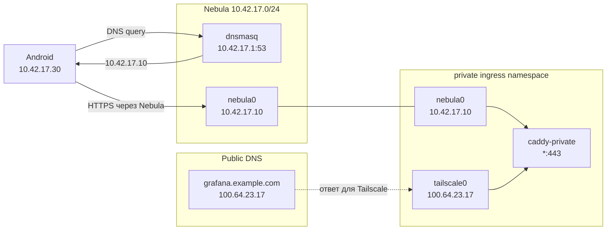

В апреле я [связал Nebula с Tailscale][old-post] через `unsafe_routes`.
Телефон входил в Nebula, gateway принимал его пакеты, делал MASQUERADE и
пересылал их в Tailscale. Схема работала, но соединяла две сети на уровне
маршрутизации. Ошибка в route, firewall или NAT могла затронуть обе стороны.

В новой схеме Nebula и Tailscale используют разные адресные пространства и
таблицы маршрутизации. Между ними нет forwarding, NAT и маршрута
`100.64.0.0/10`. Приватные сервисы доступны из обеих сетей через один
`caddy-private`, а нужный ingress выбирает DNS.

При включённом Tailscale домен `grafana.example.com` указывает на
`100.64.23.17`. В Nebula тот же домен получает адрес `10.42.17.10`. URL,
TLS-сертификат и Caddyfile остаются прежними.

## Задача

Мои приватные сервисы работают за Caddy, который делит network namespace с
Tailscale sidecar. Внутри namespace есть `tailscale0` с адресами
`100.64.23.17` и `fd7a:115c:a1e0::53a7:2a11`. Публичные DNS records для
приватных доменов указывают на эти адреса.

Mobile Nebula на Android создаёт свой VPN и передаёт системе список DNS
resolver'ов. Если оставить публичный DNS без переопределения, телефон получит
Tailscale IP, до которого из изолированной Nebula-сети нет маршрута.

Я зафиксировал четыре ограничения:

- Headscale, его DNS и ACL продолжают работать без изменений;
- Nebula не получает default route и route в `100.64.0.0/10`;
- Caddyfile и TLS-сертификаты не зависят от выбранной overlay-сети;
- выключение Nebula удаляет только её интерфейс и connected routes.

## Топология

Nebula использует отдельные IPv4 и IPv6 overlay. Все адреса, имена и домены в
статье вымышлены. В конфигурации оставлен один условный сервер, чтобы пример не
раскрывал состав рабочей сети:

| Узел | IPv4 | IPv6 | Роль |
|---|---|---|---|
| `server1` | `10.42.17.1` | `fd42:17:23::1` | lighthouse, relay, DNS |
| private ingress | `10.42.17.10` | `fd42:17:23::10` | Caddy ingress |
| Android | `10.42.17.30` | `fd42:17:23::30` | Mobile Nebula |

В рабочей сети можно держать несколько lighthouse и relay. Клиент знает их
публичные адреса и может пережить потерю одного пути. В примере Nebula работает
на UDP-порту `4244`.

IPv6 здесь относится к overlay. Серверу не нужен публичный IPv6: Nebula
переносит пакеты с ULA-адресами внутри IPv4 UDP underlay. Для dual-stack
нужны Nebula 1.10+ и сертификаты v2 с обеими сетями.



## Почему не Lighthouse DNS

Nebula умеет запускать DNS на lighthouse, но этот resolver обслуживает имена
узлов из сертификатов. Он не поддерживает дополнительные service aliases и не
пересылает запросы во внешний upstream[^1]. Мне нужны обычные FQDN вида
`grafana.example.com` и public DNS для остальных сайтов, поэтому встроенный
resolver не подходит.

На DNS-сервере работают два процесса:

- `dnsmasq` принимает запросы только на Nebula IP и переопределяет приватные
  домены;
- `ctrld` слушает `127.0.0.1:5354` и отправляет остальные запросы в Control D
  через DoH.

Системный resolver сервера и DNS-конфигурация Headscale при этом не меняются.

## Split DNS на сервере

Пример конфига DNS на `server1`:

```ini
listen-address=10.42.17.1
listen-address=fd42:17:23::1
bind-interfaces
no-resolv
no-hosts
domain-needed
bogus-priv
cache-size=1000
server=127.0.0.1#5354

local=/grafana.example.com/
address=/grafana.example.com/10.42.17.10
address=/grafana.example.com/fd42:17:23::10

local=/search.example.com/
address=/search.example.com/10.42.17.10
address=/search.example.com/fd42:17:23::10

local=/prometheus.example.com/
address=/prometheus.example.com/10.42.17.10
address=/prometheus.example.com/fd42:17:23::10
```

Остальные приватные домены добавляются теми же тремя строками. На других
DNS-узлах меняются только адреса, на которых слушает dnsmasq.

`listen-address` и `bind-interfaces` закрывают DNS от публичных интерфейсов.
`no-resolv` запрещает dnsmasq брать upstream из `/etc/resolv.conf`. Все
неприватные запросы уходят в локальный `ctrld`. dnsmasq умеет отвечать из
локальной конфигурации и пересылать остальные запросы upstream-серверу[^2].

`ctrld` использует отдельный listener на localhost и Control D upstream.
Я храню Resolver ID только в конфиге сервера:

```toml
[listener.0]
ip = "127.0.0.1"
port = 5354
restricted = true

[upstream.0]
type = "doh"
endpoint = "https://dns.controld.com/<resolver-id>"

[network.0]
name = "Local dnsmasq"
cidrs = ["127.0.0.0/8"]

[listener.0.policy]
networks = [
  {"network.0" = ["upstream.0"]},
]
```

Формат актуального конфига описан в документации `ctrld`[^3]. Для каждого
DNS-узла можно завести отдельный resolver Control D, чтобы видеть источник
запроса и не делить один профиль между серверами.

Unit для dnsmasq зависит от Nebula и `ctrld`:

```ini
[Unit]
Description=Nebula split-horizon DNS with Control D upstream
Requires=nebula.service ctrld.service
After=nebula.service ctrld.service

[Service]
Type=simple
DynamicUser=true
ExecStart=/usr/sbin/dnsmasq --keep-in-foreground \
  --conf-file=/etc/nebula-dns.conf --pid-file=
Restart=on-failure
AmbientCapabilities=CAP_NET_BIND_SERVICE
CapabilityBoundingSet=CAP_NET_BIND_SERVICE
NoNewPrivileges=true
ProtectHome=true
ProtectSystem=strict

[Install]
WantedBy=multi-user.target
```

`DynamicUser` избавляет от отдельной системной учётки. Capability разрешает
bind к порту 53, а ограничения systemd не дают процессу писать в домашние
каталоги и системные файлы.

## Два интерфейса в одном namespace

На сервере уже работали `tailscale-sidecar` и `caddy-private`. Caddy делит
network namespace с Tailscale sidecar и слушает `*:443`. Я добавил туда третий
контейнер, который запускает только Nebula:

```ini
[Unit]
Description=Nebula sidecar for existing Tailscale private ingress
After=tailscale-sidecar.service
Requires=tailscale-sidecar.service

[Container]
ContainerName=nebula-ingress
Image=docker.io/nebulaoss/nebula:1.10.3
Network=tailscale-sidecar.container
AddCapability=NET_ADMIN
AddDevice=/dev/net/tun
Volume=%h/volumes/nebula-ingress/config:/config:ro,Z
Exec=-config /config/config.yml

[Service]
Restart=always
RestartSec=5
```

Параметр `Network=tailscale-sidecar.container` помещает контейнер Nebula в уже
существующий namespace. После запуска Caddy видит два VPN-интерфейса:

```text
tailscale0  100.64.23.17/32  fd7a:115c:a1e0::53a7:2a11/128
nebula0     10.42.17.10/24   fd42:17:23::10/64
```

Caddy продолжает слушать `*:443`, поэтому принимает HTTPS через оба интерфейса.
Upstream'ы, SNI и TLS остаются общими. Порты хоста публиковать не нужно.

В ingress-конфиге Nebula нет `unsafe_routes`. Sidecar получает только
connected routes для `10.42.17.0/24` и `fd42:17:23::/64`. Он также
использует `listen.port: 0`: публичный входящий UDP этому узлу не нужен, потому
что он подключается к lighthouse и relay сам.

## Клиентский профиль

В примере Android получает один lighthouse, relay и два DNS endpoints: IPv4 и
IPv6 адрес `server1`. В рабочую конфигурацию можно добавить резервные серверы.
Существенная часть профиля выглядит так:

```yaml
static_host_map:
  "10.42.17.1": ["<server1-public-ip>:4244"]
  "fd42:17:23::1": ["<server1-public-ip>:4244"]

lighthouse:
  hosts:
    - "10.42.17.1"
    - "fd42:17:23::1"

listen:
  host: "[::]"
  port: 0

relay:
  relays:
    - "10.42.17.1"
    - "fd42:17:23::1"
  use_relays: true

mobile_nebula:
  dns_resolvers:
    - "10.42.17.1"
    - "fd42:17:23::1"
  match_domains: []
```

Для roaming-клиента Nebula рекомендует динамический UDP-порт, то есть
`listen.port: 0`[^4]. В профиле нет default route и `unsafe_routes`. Android
отправляет DNS-запросы в Nebula, а обычный интернет-трафик идёт через текущую
сеть телефона.

## Проверка изоляции

Сначала я проверил синтаксис DNS-конфига:

```bash
dnsmasq --test --conf-file=/etc/nebula-dns.conf
```

Затем сравнил private и public ответы:

```bash
dig @10.42.17.1 +short A grafana.example.com
# 10.42.17.10

dig @10.42.17.1 +short AAAA grafana.example.com
# fd42:17:23::10

dig @10.42.17.1 +short A example.net
# публичные адреса example.net
```

HTTPS проверяется с сохранением hostname, чтобы `curl` отправил правильный SNI:

```bash
curl --resolve grafana.example.com:443:10.42.17.10 \
  https://grafana.example.com/

curl --resolve grafana.example.com:443:100.64.23.17 \
  https://grafana.example.com/
```

Оба запроса должны попасть в один `caddy-private`, но через разные интерфейсы.
После этого проверяются routes:

```bash
ip route get 10.42.17.30
ip route get 100.64.23.17
ip route get 1.1.1.1
```

Nebula peer должен идти через `nebula0`, Tailscale peer через
`tailscale0`, публичный адрес через прежний default gateway. В таблицах не
должно появиться маршрута, который связывает две overlay-сети.

В этой схеме dnsmasq возвращает `10.42.17.10` и `fd42:17:23::10` для
приватных имён, а public-запросы проходят через
`ctrld`. Tailscale sidecar, `caddy-private` и Nebula ingress остаются active.

## Что дала новая схема

DNS выбирает точку входа без изменения URL. Tailscale-клиенты получают
`100.64.23.17`, Nebula-клиенты получают `10.42.17.10`. Оба адреса ведут в один
Caddy namespace.

Я убрал gateway, MASQUERADE, IP forwarding и `unsafe_routes` из пути к
приватным сервисам. Остановка Nebula не меняет Tailscale. Сбой Headscale не
ломает маршруты Nebula. Общим компонентом остаётся
`caddy-private`, потому что именно он обслуживает один набор приватных доменов
и backend'ов.

У схемы есть цена. Нужно поддерживать DNS на нескольких узлах и синхронно
обновлять список приватных доменов. Я предпочёл эту явную конфигурацию мосту
между overlay-сетями: её легко проверить через `dig`, а rollback сводится к
отключению профиля Mobile Nebula и включению Tailscale.

[old-post]: /2026/04/03/nebula-tailscale/

[^1]: [Using Lighthouse DNS with Nebula](https://nebula.defined.net/docs/guides/using-lighthouse-dns/) описывает ограничения встроенного resolver: он знает только имена Nebula hosts, не поддерживает aliases и upstream DNS.
[^2]: [dnsmasq man page](https://thekelleys.org.uk/dnsmasq/docs/dnsmasq-man.html) описывает локальные ответы, forwarding, `listen-address` и `bind-interfaces`.
[^3]: [ctrld configuration](https://github.com/Control-D-Inc/ctrld/blob/main/docs/config.md) содержит формат listeners и upstreams.
[^4]: [Nebula listen configuration](https://nebula.defined.net/docs/config/listen/) рекомендует фиксированный порт для lighthouse и динамический порт для roaming nodes.
