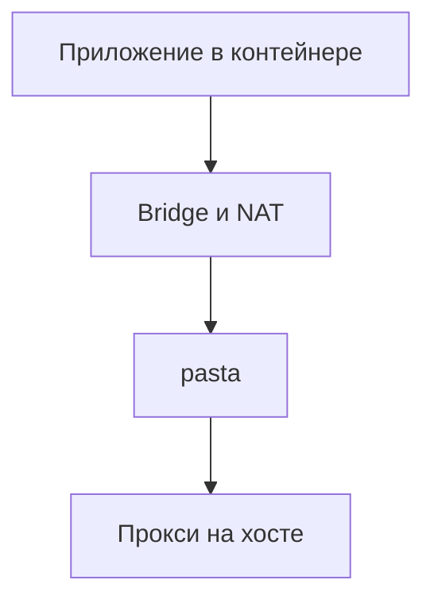

Некоторые сетевые ошибки выглядят как недоступность внешнего сервиса, хотя запрос ещё не покинул локальную машину. Недавно я разбирался с таким случаем: приложения в rootless-контейнерах периодически не могли подключиться к HTTP-прокси. Проверка с хоста проходила, процесс прокси работал, следующие запросы снова выполнялись успешно.

Причиной оказалась ошибка в pasta, сетевом компоненте, который Podman использовал для связи rootless-сети с хостом. Старые TCP-соединения оставались в его таблице, а новые подключения с теми же адресами и портами попадали в эти записи. Ни смена внешнего прокси, ни увеличение таймаутов приложения эту причину не устраняли.

## Почему долго искали не там

Приложение сообщало о таймауте подключения к прокси. Первое предположение было простым: проблема во внешнем выходе, удалённом узле или маршруте до нужного сайта. Такие сбои действительно бывают, а слово «прокси» в ошибке направляло расследование именно туда.

Проверки с хоста этому противоречили: прокси принимал соединения, внешние адреса отвечали. Но проверка с хоста пропускала часть пути, по которому шёл запрос приложения. Для rootless-контейнера между приложением и хостом находились дополнительные сетевые компоненты.

В рассматриваемой схеме путь выглядел так:



Здесь pasta связывает виртуальный сетевой интерфейс namespace с обычными сокетами хоста. У него есть собственная таблица соединений: успешного ответа прокси с хоста недостаточно, чтобы подтвердить исправность всего пути.[^pasta]

Мешал и непостоянный характер ошибки. Серия подключений могла пройти целиком, следующая давала отдельный timeout, затем всё снова работало. Перезапуск приложения не обеспечивал устойчивого результата. Загрузка машины и число открытых файлов не указывали на исчерпание ресурсов.

Первую ошибку в расследовании мы допустили именно здесь: приняли успешную проверку соседнего участка за проверку того участка, на котором происходил отказ. Позже пришлось вернуться к исходной ошибке приложения и проследить его запрос по всей локальной цепочке.

## Как нашли механизм отказа

### SYN выходит из контейнера, но соединение на хосте не появляется

Следующим шагом стали одновременные захваты пакетов в rootless namespace и на хосте. В момент отказа со стороны контейнера были видны повторные SYN. Это первые пакеты TCP handshake: клиент просит установить соединение и повторяет попытку, если не получает ответа.

Пакеты проходили bridge и NAT, но соответствующего соединения к процессу прокси на хосте не возникало. Трассировка системных вызовов pasta не показывала нового `connect()` для этой попытки. Значит, искать причину отказа именно этого подключения на внешнем маршруте было преждевременно: оно до него ещё не дошло.

Это также отделяло проблему от HTTP и TLS. Приложение не успевало отправить запрос или начать защищённое соединение. Проверка ключей доступа и настроек внешнего API ничего не объяснила бы.

### Отказ зависел от исходного порта

Обычно приложение позволяет ядру выбрать свободный source port. Мы стали задавать его явно и повторять подключения к одной и той же цели.

С одними портами соединение устанавливалось сразу. С другими попытки стабильно заканчивались таймаутом. При этом подключение с проблемным исходным портом к другому порту назначения проходило. Значение имела комбинация адресов и портов.

Смена контейнера не обязательно меняла эту комбинацию для pasta. После NAT разные адреса контейнеров могли превращаться в один адрес, видимый сетевому компоненту. Поэтому пересоздание контейнера не гарантировало освобождения занятой записи.

Так у случайного на вид сбоя появился воспроизводимый признак. Теперь можно было сравнить две почти одинаковые попытки, меняя только исходный порт.

### Старое соединение занимало место нового

Мы сопоставили сокеты процесса с его внутренней таблицей соединений. Для этого понадобились исходники и отладочные символы именно той сборки, которая работала, а также небольшая программа для чтения нужных структур. Размеры записей проверили по символам отладки, чтобы не принять неверно прочитанную память за доказательство.

Проблемным подключениям соответствовали старые записи. На стороне хоста сокеты находились в `CLOSE_WAIT`: удалённая сторона уже прислала FIN, но локальная сторона ещё не завершила свою половину соединения. Pasta передал FIN клиенту и получил подтверждение, однако запись продолжала существовать без обмена данными гораздо дольше ожидаемого.

Само состояние `CLOSE_WAIT` допустимо. Подозрительным было длительное удержание записей, а решающим стало совпадение их адресов и портов с новыми попытками подключения.

Получив новый SYN, pasta находил старую запись и передавал пакет обработчику уже установленного соединения. Для исследованного состояния и sequence numbers тот не создавал новое соединение и не формировал ответ. Клиент продолжал повторять SYN до таймаута. Это объясняло и зависимость от source port, и отсутствие `connect()` на хосте.

### Таймер, который постоянно откладывал очистку

Оставалось понять, почему записи не удалялись. В старом коде был таймер очистки после двух часов бездействия. Существенная часть обработчика выглядела так:

```c
timerfd_settime(conn->timer, 0, &new, &old);
if (old.it_value.tv_sec == ACT_TIMEOUT)
    tcp_rst(c, conn);
```

К моменту вызова таймер уже сработал. Код снова заводил его на два часа и проверял, равно ли прежнее значение двум часам. Но `timerfd_settime()` возвращает в `old.it_value` оставшееся время. У только что истёкшего таймера там ноль, поэтому условие очистки не выполнялось.[^timerfd]

Этот механизм мог повторяться неограниченно: очередное срабатывание переносило очистку ещё на два часа. Описание upstream-исправления подтверждало ту же ошибку.[^timeout-fix]

Мы отдельно собрали маленькую C-программу и повторили последовательность вызовов `timerfd` с коротким начальным ожиданием. После срабатывания прежнее оставшееся время было нулевым, ветка очистки не выбиралась. Это позволило проверить понимание системного вызова, не меняя таймеры работающего процесса.

При этом исходный эпизод незавершённого закрытия восстановить не удалось: захвата пакетов за тот момент не было. Мы установили причину удержания старых записей и отказа новых SYN. Утверждать, что конкретный FIN потеряла сеть или приложение, оснований не было.

## Как обновляли и проверяли исправление

### Что собирали, а что взяли готовым

Upstream уже удалил неработающий механизм и добавил периодический обход таблицы: соединения без активности удаляются через два–четыре часа. Дополнительно появились TCP keepalive в сторону клиента. Если клиент уже забыл соединение, он отвечает RST, и запись можно убрать раньше.[^inactivity][^keepalive]

Эти изменения вошли в релиз `2026_05_07.1afd4ed`.[^release] Для проверки мы выбрали более свежий официальный Debian-пакет с исправлениями. Из исходников мы собрали диагностические программы. Для самого passt использовали готовый `.deb`, полученный через APT с проверкой подписи репозитория и контрольных сумм пакета.

Свежего пакета не было в подключённом стабильном репозитории. Нужную сборку взяли из Debian sid через отдельные временные индексы, не добавляя sid в постоянные источники системы. До установки проверили зависимости и запустили симуляцию APT. Она должна была показать обновление только passt, без попутной замены системных библиотек.[^debian]

Совместимость такого пакета нужно проверять на конкретной системе. После установки мы сравнили полный список пакетов с исходным и убедились, что изменился только passt. Старый `.deb` сохранили для отката.

### Сначала пришлось исправить сам тест

Обычный успешный запрос не доказывал исправление: таких запросов хватало и до обновления. Нужен был опыт, в котором старая версия сохраняет забытое соединение, а новая его удаляет.

Для этого мы создали отдельную rootless-сеть и локальный TCP-сервер с коротким тестовым ответом. Сервер отправлял FIN, клиент подтверждал его, после чего удалял свой сокет через `TCP_REPAIR`, не отправляя FIN или RST. Pasta должен был остаться с записью о соединении, которого клиент уже не помнил.

Первый вариант теста оказался неверным. Клиент удалял сокет слишком быстро, до отправки отложенного ACK на FIN. Получалась проверка повторной передачи неподтверждённого FIN, а не очистки нужного нам состояния. Разницу показал захват пакетов.

Мы включили `TCP_QUICKACK`, добавили небольшое ожидание перед удалением сокета и проверку ACK в захвате. Только после этого сравнение версий стало содержательным. По окончании очистки тест повторно подключался с тем же source port и проверял ответ сервера.

| Проверка | Результат |
|---|---|
| Старая версия | Удерживала соединение всё время наблюдения, больше десяти минут |
| Новая версия до установки | Удалила соединение примерно за 32 секунды; повторное подключение с тем же портом прошло |
| Новая версия после установки | Повторила результат, в том числе с действующим профилем AppArmor |

В захвате новой версии была видна вся последовательность: keepalive, RST от ядра клиента, затем новый успешный handshake. В выбранном июльском релизе интервал проверки клиента уже сокращён до 30 секунд, что согласуется с результатом опыта.[^current]

Этот тест проверяет обнаружение соединения, забытого клиентом. Он не означает, что любое бездействующее TCP-соединение новая версия закрывает через полминуты.

### Обновить файл недостаточно

После установки нового пакета старый процесс продолжает исполнять прежний бинарник. Его накопленная таблица тоже никуда не исчезает. Поэтому обновление завершалось заменой работающего pasta.

В проверенной версии Podman был путь восстановления: при обращении к общей rootless-сети он мог обнаружить остановленный сетевой процесс и запустить новый в существующем namespace. Сначала мы испытали это в отдельной сети и убедились, что namespace, bridge и доступ к хосту сохраняются.[^podman]

Затем завершили только нужный процесс pasta, дождались его выхода и вызвали `podman unshare --rootless-netns true` от того же пользователя. Podman поднял новый процесс. Пересоздавать контейнеры не понадобилось, но текущие внешние TCP-соединения при такой замене обрываются: состояние старого pasta в новый процесс не переносится.

Это описание проверенного способа восстановления, а не универсальная команда перезапуска сети для любой версии Podman. Перед применением нужно установить, какой процесс обслуживает нужный namespace и как конкретная версия восстанавливает его после остановки.

После переключения мы проверили те самые комбинации портов, которые раньше стабильно давали timeout. Соединения устанавливались сразу. Затем проверили SOCKS, HTTP CONNECT, прямые запросы из контейнера, IPv6 и доступ к тестируемым приложениям. Состояния контейнеров и их сетевые адреса сравнили с исходными.

У установки отдельного пакета осталась эксплуатационная особенность: постоянный источник sid не подключён, поэтому следующие его версии обычный APT сам оттуда не получит. За дальнейшими исправлениями passt придётся следить отдельно.

## Что из этого следует

Главный результат расследования — воспроизводимый отказ и проверенное изменение его механизма. До обновления старая запись удерживалась, после обновления pasta обнаруживал, что клиент её забыл, и освобождал комбинацию адресов и портов. Это сильнее, чем серия успешных запросов после перезапуска.

Для диагностики полезнее всего оказалось сравнение одного и того же пути в исправном и неисправном состоянии. Проверка с хоста отвечала на свой вопрос, но ничего не говорила о прохождении запроса через rootless-сеть. Явно заданный source port превратил случайный симптом в повторяемый опыт, а чтение исходников объяснило результат.

Есть и архитектурный вывод. Отсутствие общего демона управления контейнерами не означает отсутствия общих зависимостей. В конфигурации с общим pasta сетевой процесс может влиять сразу на несколько независимых приложений. Проверка доступности должна проходить через тот же сетевой путь, которым пользуются эти приложения.

Менять контейнерную платформу ради этого дефекта мы не стали: ошибку удалось локализовать в отдельном компоненте и проверить его исправление. Длительное наблюдение всё ещё нужно для оценки устойчивости системы, но ждать его, чтобы установить причину конкретного отказа, уже не требуется.

*Примечание. Статья написана gpt-6-astra по результатам работы на сервере.*

[^pasta]: [passt и pasta: устройство и назначение](https://passt.top/passt/about/).
[^timerfd]: [timerfd_create, timerfd_settime, timerfd_gettime](https://man7.org/linux/man-pages/man2/timerfd_settime.2.html), Linux man-pages. Поле `old_value.it_value` содержит оставшееся время.
[^timeout-fix]: [Удаление неработающего inactivity timeout](https://passt.top/passt/commit/?id=e48ce41a1ec2f05846fb66d3847c2c2b6448ca71), commit upstream.
[^inactivity]: [Периодическая очистка неактивных соединений](https://passt.top/passt/commit/?id=1820103fbbf13df98257a3f5c3ba625de624b0b3), commit upstream.
[^keepalive]: [Keepalive для обнаружения забытых клиентом соединений](https://passt.top/passt/commit/?id=d2f7c21cfb949f2b1587b9475917efdd6ac549fd), commit upstream.
[^release]: [Bug 179, комментарий о выпуске исправления](https://bugs.passt.top/show_bug.cgi?id=179#c20). В исходном обращении обсуждалось состояние `FIN_WAIT_2`; сопоставлялся механизм очистки, а не полное совпадение симптомов.
[^debian]: [Пакет passt в Debian sid](https://packages.debian.org/sid/passt).
[^current]: [tcp.c в релизе 2026_07_28.f8df3f1](https://passt.top/passt/plain/tcp.c?h=2026_07_28.f8df3f1), `KEEPALIVE_INTERVAL` и `tcp_keepalive()`.
[^podman]: [Восстановление общего rootless namespace в containers/common v0.62.3](https://github.com/containers/common/blob/v0.62.3/libnetwork/internal/rootlessnetns/netns_linux.go), `getOrCreateNetns()`.
